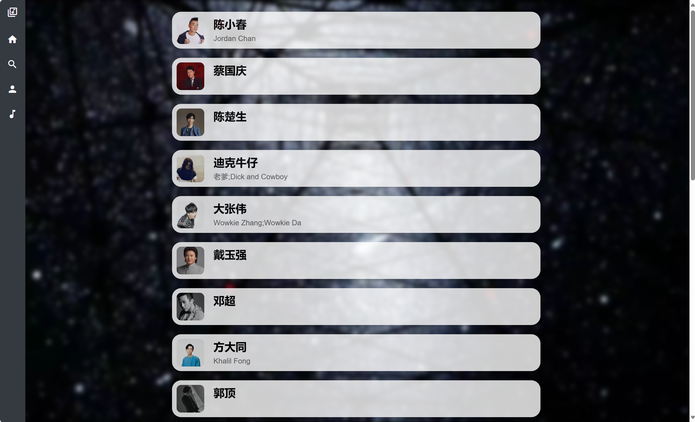
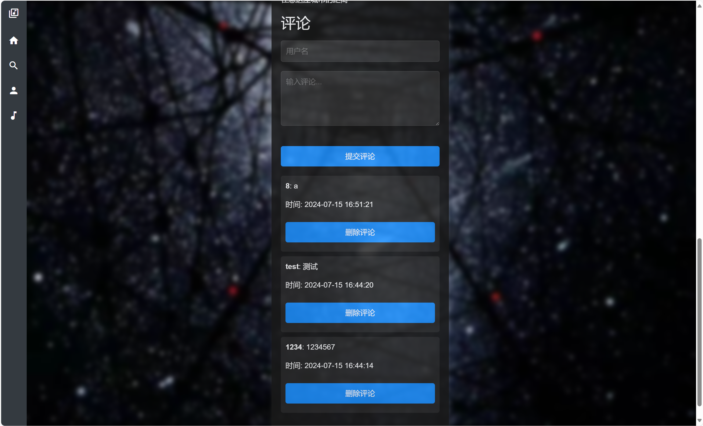
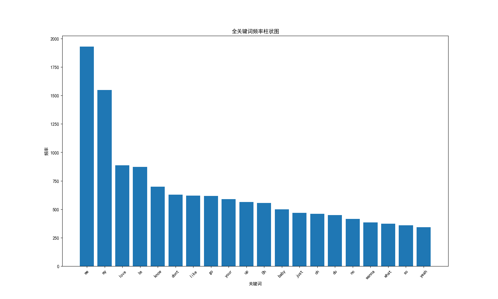
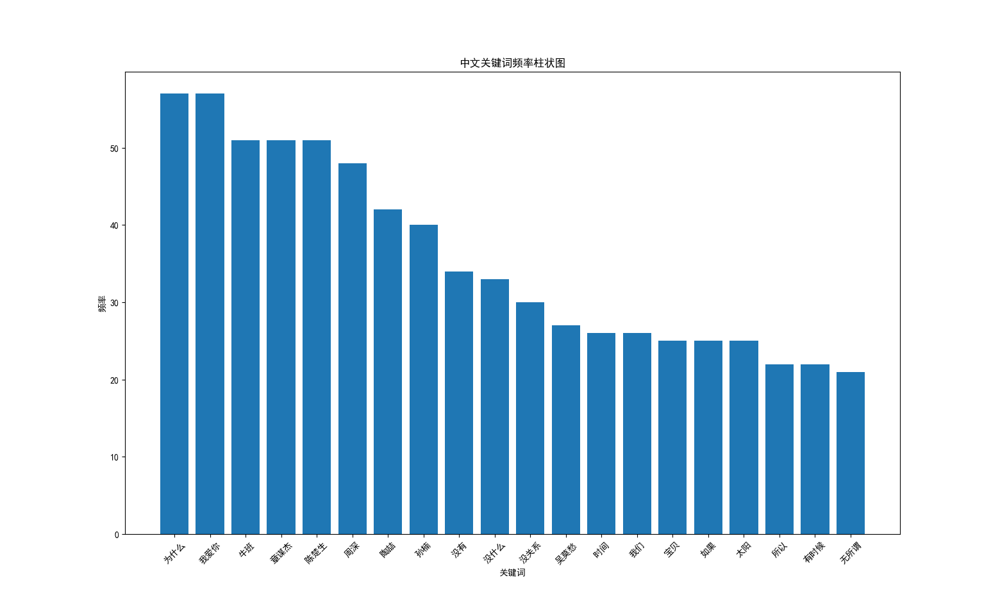
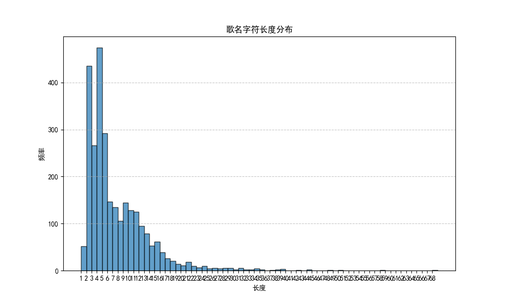
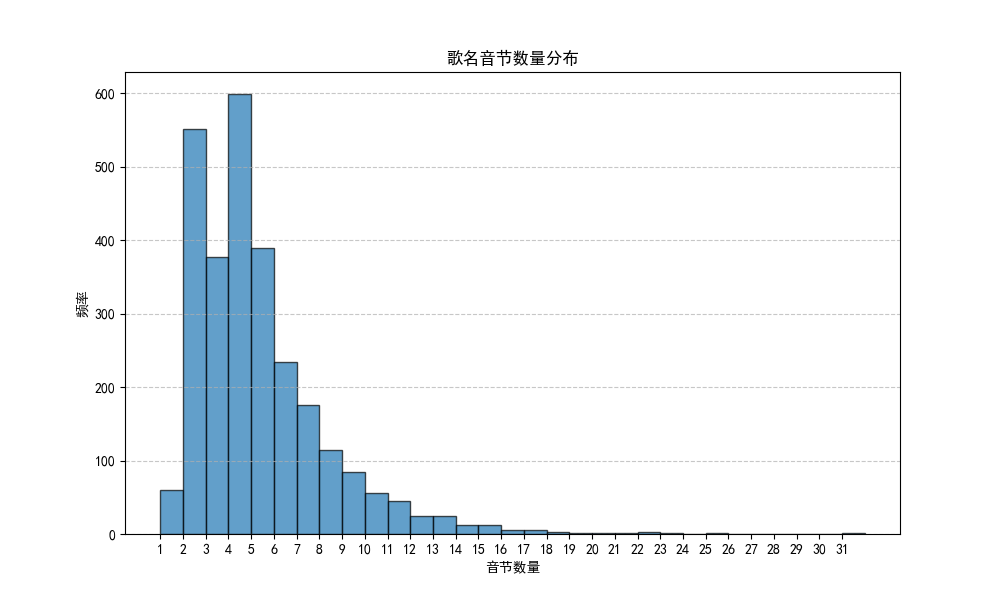
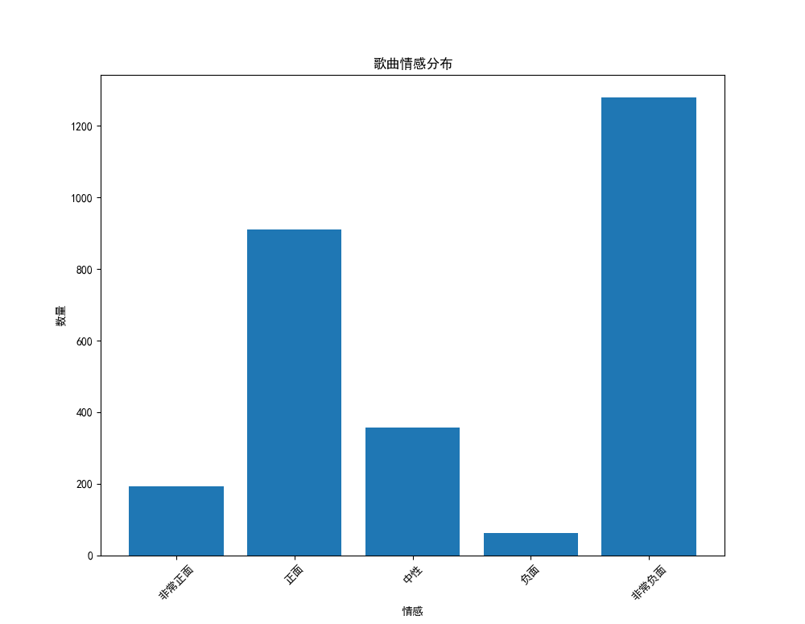

# 实验报告

##### 计36班 郑皓之 2023012168


## 爬虫（./crawler_final）

```
.
├── artist_saves.txt
├── backup
│   ├── database_before_delete_comment.db
│   ├── database_both.db
│   └── database_only_song.db
├── comments.js
├── comments.py
├── crawler_artists.py
├── crawler_relations.py
├── crawler_songs.py
├── database.db
├── database_delete_comment.py
├── musicians_process
│   ├── music.json
│   ├── music_.json
│   ├── song_saves.txt
│   └── test.py
├── song_saves.txt
└── test.py
```

**实现：**

​		数据预处理（./crawler_final/musicians_process）：通过手动拷贝浏览器中网易云官网“热门歌手”板块的相关信息，得到了music.json与music_.json两个存有120个歌手id信息的json文件，通过test.py对json读取后提取歌手id，并通过request将此120位歌手的主页下前25首歌曲的歌曲id去重后存入song_saves.txt，等待下一步操作。

​		歌曲信息获取：建立database.db文件，首先通过crawler_songs.py文件遍历2800首歌曲，通过request方法获取每首歌曲的歌名、歌手名、歌手id、歌手数量、歌词、歌词(翻译)、歌单、歌单id、原网址、图片(本地保存)、评论等信息，存入SQL库中的music类等待后续处理。其中，comments.js与comments.py为github网易云逆向相关项目涉及的评论获取解密方法，来自https://github.com/Dancing-Pierre/NetEase_cloud_music_review_reverse。**但由于后续建站过程中清空了comments故而未使用这些数据，特此注明**。

​		歌手信息获取：在获取歌曲信息的过程中，同步保存了所有歌曲前两位歌手的歌手id，去重后存入artist_saves.txt，需要注意的是，由此获得的歌手数量远多于120个（由于很多歌曲是最初120位歌手与其他歌手的合作曲）。在crawler_artists.py中，通过遍历这些歌手id对应的歌手主页，通过request方法获取每位歌手的歌手名、歌手别名、简介、原网址、图片（本地保存）等信息，存入SQL库中的artist类等待后续处理。

​		关系层建立：在crawler_relations.py中，通过遍历所有SQL中music类保存的歌手，在database.db中建立relations多对多关系层，其内含两个外键存储歌曲id与歌手id的对应关系。

​		**评论删除：由于未能成功理解github中网易云逆向项目中的解密算法，故弃用获取的评论。通过database_delete_comment.py清空了database.db中music类的所有comments**

​		数据库检查：通过./crawler_final/test.py，打印输出了当前获得的SQL文件database.db，确认无误后等待后续处理。（在不同阶段，对database.db进行备份，存储在backup文件夹中）

**数据量：**共采集2801首歌曲，593位歌手，并离线保存了所有歌曲、歌手的图片文件


## Web系统设计（./web_final）

```
.
├── database.db
├── manage.py
├── music
│   ├── __init__.py
│   ├── admin.py
│   ├── apps.py
│   ├── migrations
│   │   ├── __init__.py
│   │   └── __pycache__
│   ├── models.py
│   ├── static
│   │   ├── artist ── ...
│   │   ├── background.jpg
│   │   └── img ── ...
│   ├── templates
│   │   ├── base.html
│   │   └── music
│   ├── tests.py
│   ├── urls.py
│   └── views.py
└── web
    ├── __init__.py
    ├── asgi.py
    ├── settings.py
    ├── urls.py
    └── wsgi.py
```

**功能实现：**

系统主页：（按照项目要求，若直接访问网页根目录会跳转到music_list.html作为主页，此为单独设计的主页，可通过侧边栏按钮到达）


歌曲列表：主页，可在一页展示30首歌曲，通过点击可跳转到歌曲详情页，可通过侧边栏按钮到达


歌手列表：可在一页展示20位歌手，通过点击可跳转到歌手详情页，可通过侧边栏到达




搜索：可选择搜索歌曲或歌手，支持部分搜索和关键词搜索，可通过侧边栏到达


搜索歌曲：上方显示搜索相关信息、搜索结果数量、搜索耗时（后端同样显示），完全匹配展示歌名、歌手与搜索内容完全一致的歌曲，部分匹配展示歌名、歌手、歌词与搜索内容部分一致的歌曲


搜索歌手：上方显示搜索相关信息、搜索结果数量、搜索耗时（后端同样显示），完全匹配展示歌手名、歌手演唱的歌曲名与搜索内容完全一致的歌手，部分匹配展示歌手名、歌手简介与搜索内容部分一致的歌手


翻页控件：歌曲列表每30人一页，歌手列表每20人一页，搜索结果界面“完全匹配”永远在上方完整展示，“部分匹配”每20个一页


歌曲详情页：依次展示歌曲名、歌曲图片（本地加载）、歌手（跳转到站内）、原网址（跳转至网易云）、歌单（跳转至网易云）、歌词


评论控件：在每首歌最后的评论区可以发送评论，评论由新至旧显示，永久保存（实时更新database.db），评论均可删除




歌手详情页：依次展示歌曲名、歌手图片（本地加载）、原网址（跳转至网易云）、歌手简介、歌曲（跳转到站内）


**技术与算法：**

搜索模块（仅展示核心代码，详见./web_final/music/views.py）：通过Django自带Q方法实现

```python
    start_time = time.time()
    
if search_type == 'song':
    full_matches = music.objects.filter(Q(music_name__iexact=query) | Q(artist_name__iexact=query) | Q(sub_artist_name__iexact=query) | Q(lyrics_pure__iexact=query) | Q(translated_lyrics_pure__iexact=query))
    partial_matches = music.objects.filter(Q(music_name__icontains=query) | Q(artist_name__icontains=query) | Q(sub_artist_name__icontains=query) | Q(lyrics_pure__icontains=query) | Q(translated_lyrics_pure__icontains=query)).exclude(id__in=[song.id for song in full_matches])
else:  # 'artist'
    song_matches = music.objects.filter(Q(music_name__iexact=query)).values_list('artist_name', flat=True)
    sub_song_matches = music.objects.filter(Q(music_name__iexact=query)).values_list('sub_artist_name', flat=True)
    if (len(song_matches)):
        full_matches = artist.objects.filter(Q(artist_name__iexact=query) | Q(artist_info__iexact=query) | Q(artist_name__iexact=str(song_matches[0])) | Q(artist_name__iexact=str(sub_song_matches[0])))
    else:
        full_matches = artist.objects.filter(Q(artist_name__iexact=query) | Q(artist_info__iexact=query))
    partial_matches = artist.objects.filter(Q(artist_name__icontains=query) | Q(artist_info__icontains=query)).exclude(id__in=[artist.id for artist in full_matches])
    
end_time = time.time()
search_time = end_time - start_time
```


翻页模块（仅展示核心代码，详见./web_final/music/views.py）：以歌曲列表页为例，通过Paginator实现

```python
paginator = Paginator(song_list, 30)   # 30 each time

page_number = request.GET.get('page')
page_obj = paginator.get_page(page_number)

return render(request, 'music/song_list.html', {'page_obj': page_obj})
```


评论增删（仅展示核心代码，详见./web_final/music/views.py）：通过json进行压缩存储在database中music类的comment字段中（TEXT类型），以时间作为唯一标识id，实现评论新到旧显示

```Python
def add_comment(request, music_id_in):
    if request.method == 'POST':
        song = get_object_or_404(music, id=music_id_in)
        new_comment = {
            'username': request.POST['username'],
            'text': request.POST['comment_text'],
            'time': timezone.localtime().strftime('%Y-%m-%d %H:%M:%S'),
            'id': str(timezone.now().timestamp())  # unique
        }
        comments = json.loads(song.comment) if song.comment else []
        comments.append(new_comment)
        song.comment = json.dumps(comments)
        song.save()
    return redirect('song_detail', music_id_in=music_id_in)

def delete_comment(request, music_id_in, comment_id):
    if request.method == 'POST':
        song = get_object_or_404(music, id=music_id_in)
        comments = json.loads(song.comment) if song.comment else []
        comments = [comment for comment in comments if comment['id'] != comment_id]
        song.comment = json.dumps(comments)
        song.save()
    return redirect('song_detail', music_id_in=music_id_in)
```

特别注意，在./web_final/web/settings.py中，指定了上海时区以确保时间的准确性

```Python
TIME_ZONE = 'Asia/Shanghai'
USE_TZ = True
```


数据库引用（详见./web_final/music/models.py）：以artist为例，通过声明class Meta并给出db_table值，可以强行指定database中的类名，避免django自动添加默认字段

```python
class artist(models.Model):
    class Meta:
        db_table = 'artist'
    id = models.IntegerField(primary_key=True)
    url = models.TextField()
    artist_name = models.TextField()
    sub_artist_name = models.TextField(blank=True, null=True)
    artist_info = models.TextField(blank=True, null=True)
    img_url = models.TextField(blank=True, null=True)
```

并通过在./web_final/web/settings.py中指定databse.db，成功地高效转移先前获取的database.db

```python
DATABASES = {
    'default': {
        'ENGINE': 'django.db.backends.sqlite3',
        'NAME': BASE_DIR / 'database.db',
    }
}
```


侧边栏设计（详见./web_final/music/templates/base.html）：通过JavaScript代码，成功为侧边栏的收缩添加过渡动画

```python
document.addEventListener('DOMContentLoaded', function() {
    var sidebar = document.getElementById('sidebar');
    var content = document.querySelector('.content');
    var sidebarItemsText = document.querySelectorAll('.sidebar-text');

    function expandSidebar() {
        if (isAnimating) return;
        isAnimating = true;

        sidebar.classList.add('expanded');
        content.classList.add('expanded');
        localStorage.setItem('sidebar-expanded', 'true');
        setTimeout(function() {
            sidebarItemsText.forEach(function(itemText) {
                itemText.classList.add('expanded');
            });
            isAnimating = false;
        }, 200);
    }

    function collapseSidebar() {
        if (isAnimating) return;
        isAnimating = true;

        localStorage.setItem('sidebar-expanded', 'false');
        sidebarItemsText.forEach(function(itemText) {
            itemText.classList.remove('expanded');
        });
        setTimeout(function() {
            sidebar.classList.remove('expanded');
            content.classList.remove('expanded');
            isAnimating = false;
        }, 100);
    }

    sidebar.addEventListener('mouseenter', function() {
        if (isAnimating) return;
            expandSidebar();
        });

    sidebar.addEventListener('mouseleave', function(event) {
        if (!sidebar.contains(event.relatedTarget)) {
            if (isAnimating) return;
            collapseSidebar();
        }
    });
            
});
```


扩散效果（以./web_final/music/templates/base.html为例）：通过对click的监听，增加按钮点按时以鼠标为中心的扩散UX效果

```python
links.forEach(function(link) {
    link.addEventListener('click', function(e) {
        var rect = link.getBoundingClientRect();
        var ripple = document.createElement('span');
        ripple.className = 'ripple';
        ripple.style.width = ripple.style.height = Math.max(rect.width, rect.height) + 'px';
        link.appendChild(ripple);
        ripple.style.left = e.clientX - rect.left - ripple.offsetWidth / 2 + 'px';
        ripple.style.top = e.clientY - rect.top - ripple.offsetHeight / 2 + 'px';

        setTimeout(function() {
            window.location.href = link.href;
        }, 200);

        ripple.addEventListener('animationend', function() {
            ripple.parentNode.removeChild(ripple);
        });

        e.preventDefault();
    });
});
```


**CSS及其余HTML上的设计在此不过多赘述。**

**<u>特别注明，由于网络学堂上传限制，存储的歌曲与歌手图片并未被上传！！！（./web_final/music/static/）</u>**


## 数据分析

从爬取的数据出发进行数据分析，得出以下三个有意义的结论：

### 分析一：歌词词频与词云图

**思路：**从数据库中提取歌词进行词频分析，剔除歌词文本中可能高频存在的非歌词行（如"作词：XXX"等）、时间戳（如"[00:00:00]"）、标点符号，再通过wordcloud库进行词云图生成、matplotlib进行图片绘制。（完整代码稍后给出）




不难发现，在对所有歌词直接进行词频统计后，出现频率前20的关键词均为英文单词，仅在词云图中可以看到一些较小的中文词汇。因而由此推断：英文单词凭借其部分基本词汇天然出现频率较高，如"I","my","what"等，使得这些英文词的出现显著多于中文词汇（由后图可知存在数量级差距），占据全部歌词词频的靠前位置。前20高频词几乎全部是常见于英文句中的基本词汇。

然而，我们也希望看到在排除掉这些英文单词后，中文单词的出现频率如何？因此对从数据库中获取到的歌词进行二次处理，去除所有英文字段再进行相同数据处理和图表生成，得到中文词云图和中文词频图：




首先我们注意到有一些歌手出现在其中，经查询发现是部分歌词中存在歌手名用于标识歌词由谁唱出（由于数据源难以处理故未能在上图中排除其影响）。忽略这些歌手后，我们不难发现，除了“为什么”,“有时候”,“所以”之外，“太阳”,“宝贝”,“时间”等具有实义的单词出现频率同样较高。此外，英文“love”与中文“我爱你”的出现频率分居两词频表前三。

**结论：英语常用词汇的反复出现使得其在歌曲中的词频显著高于中文词汇。相比之下，英语词汇的基本词汇出现较多，中文词在基本词汇之外还有一些表义词汇出现较多。**

**代码：**（./data_analysis/lyrics_cloud.py）

```python
import sqlite3
import jieba
from jieba import analyse
from wordcloud import WordCloud
import matplotlib.pyplot as plt
from collections import Counter
import re

plt.rcParams['font.sans-serif'] = ['SimHei']   # Matplotlib中文声明
plt.rcParams['axes.unicode_minus'] = False

conn = sqlite3.connect('database.db')
cursor = conn.cursor()
cursor.execute("SELECT lyrics_pure FROM music")
lyrics_data = cursor.fetchall()
conn.close()

excluded_phrases = [
    "作词", "作曲", "编曲", "制作人", "出品", "人声编辑", "录音", "总监", "原唱", "设计", "监制", "钢琴", "音频编辑", "统筹", "企划", "合音", "发行", "封面", "推广", "营销",
    "音乐统筹", "混音", "母带", "营销推广", "项目总监", "音乐总监", "合声", "键盘", "吉他", "和音", "贝斯", "打击乐", "长号", "萨克斯", "小号", "弦乐", "大提琴", "小提琴", "录音", "混音", "作词", "作曲"
]

lyrics_text = "\n".join([item[0] for item in lyrics_data])
lyrics_lines = lyrics_text.split('\n')
filtered_lines = [line for line in lyrics_lines if not any(phrase in line for phrase in excluded_phrases)] # 去非歌词行
cleaned_lines = [re.sub(r'\[.*?\]', '', line) for line in filtered_lines] # 去时间戳
cleaned_text = " ".join(cleaned_lines)
cleaned_text = re.sub(r'[^\w\s]', '', cleaned_text) # 去标点

keywords = analyse.extract_tags(cleaned_text, topK=1000, withWeight=False) # 关键词

wordcloud = WordCloud(width=800, height=400, background_color='white', font_path='simhei.ttf').generate(' '.join(keywords))

plt.figure(figsize=(10, 5))
plt.imshow(wordcloud, interpolation='bilinear')
plt.axis('off')
plt.title('全歌词词云图') # lyrics_cloud_all.png
plt.show()

words_count = Counter(cleaned_text.split())
keywords_frequency = {word: count for word, count in words_count.items() if word in keywords} # 词频统计
sorted_keywords_frequency = sorted(keywords_frequency.items(), key=lambda x: x[1], reverse=True) # 按次数排序
# print(sorted_keywords_frequency)

words, frequencies = zip(*sorted_keywords_frequency)

plt.figure(figsize=(20, 10))
plt.bar(words[:20], frequencies[:20])
plt.xticks(rotation=45)
plt.xlabel('关键词')
plt.ylabel('频率')
plt.title('全关键词频率柱状图')
plt.show() # lyrics_statistics_all.png


chinese_text = re.sub(r'[a-zA-Z]', '', cleaned_text) # 去英文单独分析中文
chinese_text = re.sub(r'\s+', ' ', chinese_text)

keywords_cn = analyse.extract_tags(chinese_text, topK=1000, withWeight=False)

wordcloud_cn = WordCloud(width=800, height=400, background_color='white', font_path='simhei.ttf').generate(' '.join(keywords_cn))

plt.figure(figsize=(10, 5))
plt.imshow(wordcloud_cn, interpolation='bilinear')
plt.axis('off')
plt.title('中文歌词词云图')
plt.show() # lyrics_cloud_chinese.png

words_count_cn = Counter(chinese_text.split())
keywords_frequency_cn = {word: count for word, count in words_count_cn.items() if word in keywords}
sorted_keywords_frequency_cn = sorted(keywords_frequency_cn.items(), key=lambda x: x[1], reverse=True)

words_cn, frequencies_cn = zip(*sorted_keywords_frequency_cn)

plt.figure(figsize=(20, 10))
plt.bar(words_cn[:20], frequencies_cn[:20])
plt.xticks(rotation=45)
plt.xlabel('关键词')
plt.ylabel('频率')
plt.title('中文关键词频率柱状图')
plt.show() # lyrics_statistics_chinese.png
```

### 分析二：歌名长度分析

**思路：**同样先从数据库中提取歌名，对每个歌名的（字符）长度进行统计，并由matplotlib进行绘制。（完整代码稍后给出）得到下表：



从图中不难看出，大多数歌名的字符长度集中在较短的范围内，特别是在长度为4的附近。这表明短歌名在音乐中更为常见，推测更短的歌名更有利于记忆与传播。然而，也有少部分超过10，甚至超过30长度的歌名出现。推测是由于部分歌名存在修饰（如"XXX Remix"）以及英文字符按字母计数的原因，故对此想法进行验证：

相比于字符数量，音节数量更能表征一首歌的歌名是否容易读出与记忆。因此，首先通过正则表达式对歌名中的“()”与“[]”进行去除，再对每首歌的歌名进行音节计数。得到下表：



不难发现，歌名音节数超过10个的歌名占比很小，经程序计算，音节数小于等于10的歌曲占到全部歌曲的94.89%。这充分验证了上述推测，即“短歌名”，特别是短于10个音节的“短音节歌名”，在歌曲中更为常见。

**结论：短音节歌名在歌曲中占据绝大多数，将有利于歌曲的记忆与传播。音节数小于等于10的歌曲在全部歌曲中占比超过90%。**

**代码：**（./data_analysis/name_length.py）

```python
import sqlite3
import re
import matplotlib.pyplot as plt


plt.rcParams['font.sans-serif'] = ['SimHei']   # Matplotlib中文声明
plt.rcParams['axes.unicode_minus'] = False

conn = sqlite3.connect('database.db')
cursor = conn.cursor()
cursor.execute("SELECT music_name FROM music")
music_names = cursor.fetchall()
conn.close()

music_names = [name[0] for name in music_names]
truncated_names = [name[:80] + '...' if len(name) > 80 else name for name in music_names]
name_lengths = [len(name) for name in truncated_names] # 歌名长度

plt.figure(figsize=(10, 6))
plt.hist(name_lengths, bins=range(1, max(name_lengths) + 2), edgecolor='black', alpha=0.7)
plt.title('歌名字符长度分布')
plt.xlabel('长度')
plt.ylabel('频率')
plt.xticks(range(1, max(name_lengths) + 1))
plt.grid(axis='y', linestyle='--', alpha=0.7)
plt.show() # name_length_character.png

cleaned_names = [re.sub(r'\(.*?\)|\[.*?\]', '', name) for name in music_names] # 去歌名修饰

def count_syllables(name): # 音节计数
    chinese_syllables = len(re.findall(r'[\u4e00-\u9fff]', name))
    english_words = re.findall(r'\b\w+\b', name)
    english_syllables = sum(len(word) // 2 + 1 for word in english_words if re.search(r'[a-zA-Z]', word))
    return chinese_syllables + english_syllables

# print(count_syllables("test"))
# print(count_syllables("sophisticated"))
# print(count_syllables("你好"))

syllable_counts = [count_syllables(name) for name in cleaned_names]

plt.figure(figsize=(10, 6))
plt.hist(syllable_counts, bins=range(1, max(syllable_counts) + 2), edgecolor='black', alpha=0.7)
plt.title('歌名音节数量分布')
plt.xlabel('音节数量')
plt.ylabel('频率')
plt.xticks(range(1, max(syllable_counts) + 1))
plt.grid(axis='y', linestyle='--', alpha=0.7)
plt.show() # name_length_syllable.png

less_equal_10 = [count for count in syllable_counts if count <= 10]
percentage = (len(less_equal_10) / len(syllable_counts)) * 100
print(f"{percentage:.2f}%") # 歌名音节≤10的总频率百分比
```

### 分析三：歌曲情感统计

**思路：**对于各个歌曲歌词所展现出的情感如何，尝试引入PyTorch中的预训练模型BERT对每首歌的歌词进行情感判断。按等级划分后得到下表：



**结论：在采集到的2800首歌曲中接近50%的歌曲的情感为“负面”，且这其中大多明确表明了负面情感。推测表达部分负面情感的歌曲可以引起听者的共情（也许印证了生活不如意者十有八九？）**

**代码：**（./data_analysis/music_emotion.py）

```python
import sqlite3
import re
import matplotlib.pyplot as plt
from transformers import AutoTokenizer, AutoModelForSequenceClassification, pipeline
from collections import Counter

plt.rcParams['font.sans-serif'] = ['SimHei']   # Matplotlib中文声明
plt.rcParams['axes.unicode_minus'] = False

label_mapping = {
    '1 star': '非常负面',
    '2 stars': '负面',
    '3 stars': '中性',
    '4 stars': '正面',
    '5 stars': '非常正面'
}
expected_order = ['非常正面', '正面', '中性', '负面', '非常负面']

conn = sqlite3.connect('database.db')
cursor = conn.cursor()
cursor.execute("SELECT lyrics FROM music")
lyrics_data = cursor.fetchall()
conn.close()

lyrics = [lyric[0] for lyric in lyrics_data]

def preprocess_text(text):
    text = text.lower()
    text = re.sub(r'[^a-zA-Z\u4e00-\u9fff\s]', '', text)  # 保留字母和中文
    text = re.sub(r'\s+', ' ', text).strip()
    return text

preprocessed_lyrics = [preprocess_text(lyric) for lyric in lyrics]

model_name = "nlptown/bert-base-multilingual-uncased-sentiment"
tokenizer = AutoTokenizer.from_pretrained(model_name)
model = AutoModelForSequenceClassification.from_pretrained(model_name)
classifier = pipeline('sentiment-analysis', model=model, tokenizer=tokenizer, truncation=True)
predictions = classifier(preprocessed_lyrics) # 情感分类

predicted_labels = [pred['label'] for pred in predictions]
mapped_labels = [label_mapping[label] for label in predicted_labels]
label_counts = Counter(mapped_labels)
sorted_counts = [label_counts[label] if label in label_counts else 0 for label in expected_order]

plt.figure(figsize=(10, 6))
plt.bar(expected_order, sorted_counts)
plt.title('歌曲情感分布')
plt.xlabel('情感')
plt.ylabel('数量')
plt.xticks(rotation=45)
plt.show() # music_emotion.png
```